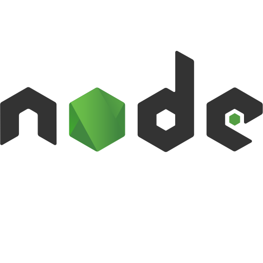

## 🧠 Навыки:
### Основной стек: 
Backend:  **Java**,  **Spring Boot**,  **Nodejs**,  **NestJS** 
Frontend:  **Vue**,  **Vuetify**,  **Nuxt** 
Прочее:  **Docker**,  **Git**,  **PostgreSQL**,  **MongoDB** 
Языки: 🇷🇺: Родной, 🇺🇸: **A2**

 

### 🕵🏻‍♀️ Личные качества:
<table>
  <tbody>
    <tr>
      <td align="center"><h1>🙌</h1><h3>Уверенный пользователь ПК</h3></td>
      <td></td>
    </tr>
    <tr align="center">
      <td></td>
      <td><h1>🤝</h1><h3>Опыт работы в большой команде 𐦂𖨆𐀪𖠋𐀪𐀪</h3></td>
    </tr>
	<tr align="center">
      <td><h1>☝️</h1><h3>Подхожу к работе с ответсвенностью</h3></td>
      <td><image src="./assets/call_in_pants.webp"></td>
    </tr>
	<tr align="center">
      <td></td>
      <td><h1>💰</h1><h3>Не гонясь за прибылью, работаю на результат</h3></td>
    </tr>
    <tr align="center">
      <td><h1>💪</h1><h3>Профессионально довожу проекты до завершения</h3></td>
      <td><image src="./assets/docker-project-2.webp"></td>
    </tr>
    <tr align="center">
      <td></td>
      <td><h1>🤙</h1><h3>Всегда на связи</h3></td>
    </tr>
  </tbody>
</table>

 

<!--
### ⚒️ Чем занимался
- Делал расшиения для chrome 📦
- Telegram-ботов 🤖
- Плагины для Atlassian Jira 🌀
-->

### ☎️ Контакты
Свяжитесь со мной в телеге: 👉 [@strukoff97](https://t.me/strukoff97) 👈 
Открыт к 💰 взаимовыгодным 💡 идеям и 📦 предложениям 🤝. 

$${\color{#a0a0a0} ATS…tags}$$

  <kbd> Java</kbd>
  <kbd> Spring Boot</kbd>
  <kbd> Maven</kbd>
  <kbd>Jackson</kbd>
  <kbd>JPA</kbd>
  <kbd> Hibernate</kbd>
  <kbd> Lombok</kbd>
  <kbd>MapStruct</kbd>
  <kbd> Node.js</kbd>
  <kbd> NestJS</kbd>
  <kbd> TypeScript</kbd>
  <kbd>Express.js</kbd>
  <kbd> VueJS</kbd>
  <kbd> Nuxt</kbd> <kbd>Pinia</kbd> <kbd>Vuex</kbd> <kbd>Vuetify</kbd>
  <kbd>Linux</kbd>
  <kbd> GNU Bash</kbd>
  <kbd>shell</kbd>
  <kbd>regexp</kbd>
  <kbd>ssh</kbd>
  <kbd>sed</kbd>
  <kbd>awk</kbd>
  <kbd>Vscode</kbd>
  <kbd> Chrome Extensions</kbd>
  <kbd>Telegram Bots</kbd>
  <kbd> Git</kbd>
  <kbd>Jira</kbd>
  <kbd>Confluence</kbd>
  <kbd>Bitbucket</kbd>
  <kbd>Script Runner</kbd>
  <kbd>MyGroovy</kbd>
  <kbd>Atlassian SDK</kbd>
  <kbd>SQL</kbd>
  <kbd>MSSQL</kbd>
  <kbd>Microsoft SQL Server</kbd>
  <kbd>Transact-SQL</kbd>
  <kbd>PostgreSQL</kbd>
  <kbd>MySQL</kbd>
  <kbd>SQLite</kbd>
  <kbd>ORM</kbd>
  <kbd>MongoDB</kbd>
  <kbd>Docker</kbd>
  <kbd>Grafana</kbd>
  <kbd>NGINX</kbd>
  <kbd>Laravel</kbd>
  <kbd>HTML5</kbd>
  <kbd>CSS3</kbd>
  <kbd>SCSS</kbd>
  <kbd>Tailwind</kbd>
  <kbd>jQuery</kbd>
  <kbd>gRPC</kbd>
  <kbd>REST</kbd>
  <kbd>JWT</kbd>
  <kbd>PWA</kbd>
  <kbd>NPM</kbd>
  <kbd>ESLint</kbd>
  <kbd>Swagger</kbd>

 

<!--
## То, что мне знакомо
image:

## Интересные проекты

💊 🚬 ☝ 😵‍💫 ☠️
🦥🦦🐕‍🦺🦍🐸📅

## 

Apache Cordova
Apache Tomcat
ENV
Adobe Illustrator
Adobe Photoshop
Android
Android Studio
Angular
Apache Lucene
Apache Groovy
Apache Kafka
Apache NetBeans IDE
Apache Solr
Apache Tomcat
Atlassian
Awesome Lists
Babel
Bamboo
Bitbucket
Chai
Composer
CSS
SCSS
CSS Wizardry
CSS Modules
curl
Docker
EditorConfig
Electron
Express
Firebase
Fluentd
Flutter
Git
Go
Google Chrome
Gradle
GraphQL
GTK
Handlebars.js
Heroku
HTML
Ionic
iOS
JavaScript
Jest
Jenkins
JSON
Joomla
Kali Linux
Keystone
Kotlin
Kubernetes
Let's Encrypt
libuv
Linux
MariaDB
NestJS
Next.js
Node.js
Nuxt.js
OpenStreetMap
PHP
Postman
Prisma
Qt
RabbitMQ
React
Redux
Roblox
Rust
Selenium
Socket.io
Svelte
Swift
Telegram
TypeScript
Ubuntu
Vim
Visual Studio Code
Vite
Vuetify
Vue.js
Vulkan
WebAssembly
WebGL
Webpack
Wireshark

Опыт работы в большой команде:
https://www.google.com/search?q=web+%D1%80%D0%B0%D0%B7%D1%80%D0%B0%D0%B1%D0%BE%D1%82%D1%87%D0%B8%D0%BA+%D0%BC%D0%B5%D0%BC+%D0%B3%D0%B0%D0%BB%D0%B5%D1%80%D0%B0&sca_esv=0fbbe9a4f1f0cabc&udm=2&biw=1920&bih=1079&sxsrf=ADLYWII7Ye1l5vM4t4H5r5UNbE4lSY5ExQ%3A1734344800738&ei=YABgZ7XaLOWowPAPisniuQw&ved=0ahUKEwi1ipDuiayKAxVlFBAIHYqkOMcQ4dUDCBE&uact=5&oq=web+%D1%80%D0%B0%D0%B7%D1%80%D0%B0%D0%B1%D0%BE%D1%82%D1%87%D0%B8%D0%BA+%D0%BC%D0%B5%D0%BC+%D0%B3%D0%B0%D0%BB%D0%B5%D1%80%D0%B0&gs_lp=EgNpbWciLndlYiDRgNCw0LfRgNCw0LHQvtGC0YfQuNC6INC80LXQvCDQs9Cw0LvQtdGA0LBI4RtQ7QpYyhhwAXgAkAEAmAHkAaAB0AqqAQUwLjUuMrgBA8gBAPgBAZgCAKACAJgDAIgGAZIHAKAHuwI&sclient=img#vhid=cu_BUeeXg5TWvM&vssid=mosaic

Отзывчивость в любое время:
https://www.google.com/search?sca_esv=0fbbe9a4f1f0cabc&sxsrf=ADLYWIKg8YuDg3s2ie6EXIF0hVTEcYssaw:1734345777924&q=%D0%BD%D0%B5%D0%B2%D1%8B%D1%81%D0%BF%D0%B0%D0%B2%D1%88%D0%B8%D0%B9%D1%81%D1%8F+%D0%BC%D0%B5%D0%BC&udm=2&fbs=AEQNm0CGfDXdj13FQehaMZIk5cNv9t97gWtkell7b5y_NhMY5qJ_VyjYBIzoP0x4xSWWkZ2mMlp7mX8cOGlrmekpn_78Ss28pUdXSnUe-cJ7qJQ-hO2ZDV2MQkaQb-U5sqSiWrEJhj2EQMDu9B2-ecGkwxBegFhZ7TZaWxQVxX0Tmj4QK6Aue7dBNdqElL8g57rwtS7bAmyn1QKkGc8kFumjLcBJfczCjA&sa=X&ved=2ahUKEwjX6IrAjayKAxXhGBAIHVZ-GkkQtKgLegQIGxAB&biw=1920&bih=1079&dpr=1#vhid=FYkYCfLXEmDsNM&vssid=mosaic

https://www.google.com/search?q=%D0%B2%D1%80%D0%B5%D0%BC%D1%8F%20%D0%BC%D0%B5%D0%BC%20%D0%BC%D0%BD%D0%BE%D0%B3%D0%BE%20%D1%87%D0%B0%D1%81%D0%BE%D0%B2&hl=ru&tbs=rimg:CY-1Mdt-SftAYQg0sjeYD3WmsgIAwAIA2AIA4AIA&udm=2&sa=X&ved=0CBoQuIIBahcKEwig0J7kj6yKAxUAAAAAHQAAAAAQEQ&biw=1920&bih=1079&dpr=1#vhid=gu11BeVep7e0AM&vssid=mosaic

Мне можно доверять:
https://www.google.com/search?sca_esv=e6f3bf325e5684b2&sxsrf=ADLYWIL4TrTdkysx29FB6JOq0T67sHxKtA:1734371261485&q=%D0%9C%D0%BD%D0%B5+%D0%BC%D0%BE%D0%B6%D0%BD%D0%BE+%D0%B4%D0%BE%D0%B2%D0%B5%D1%80%D1%8F%D1%82%D1%8C&udm=2&fbs=AEQNm0DYkPM5Fs3DHyfgKEiHM2JLAuZdGhFch85A6jbN_3lqN5cxoCr6ijbJuh5HTvbPh0ZP-2HFvZayc2FFsss58MOBgkVXppE4b_R90VlanY52ZA_sCIPwlKEhFF8Z7WVR7hbNuCbUarxCCTVI18N9_6YmCa46ZNIjRAV8vi6JRN-CEyH5IWL9MgS_s9Orf3ext3oFXhwJuUs8qjgF42MlGDPAPSOL5Q&sa=X&ved=2ahUKEwiL_8u37KyKAxUmIhAIHfdUAO4QtKgLegQIFBAB&biw=1920&bih=881&dpr=1#vhid=0Hv56TeQyhLVEM&vssid=mosaic

я разбираюсь в технологиях
https://www.google.com/search?q=meme+bsod+fail&sca_esv=e6f3bf325e5684b2&udm=2&biw=1920&bih=881&sxsrf=ADLYWIJzkedEHqKlU8QfzYxYtRlZad-Jkg%3A1734370752637&ei=wGVgZ-3MJrq-wPAPl_C7wA8&ved=0ahUKEwjtrPrE6qyKAxU6HxAIHRf4DvgQ4dUDCBE&uact=5&oq=meme+bsod+fail&gs_lp=EgNpbWciDm1lbWUgYnNvZCBmYWlsSIcfULsLWK8dcAF4AJABAJgBeqABjwWqAQMwLja4AQPIAQD4AQGYAgCgAgCYAwCIBgGSBwCgB44C&sclient=img#imgrc=gvwmuORqZw0mIM&imgdii=8p4m5QtCAA3eNM

-->
